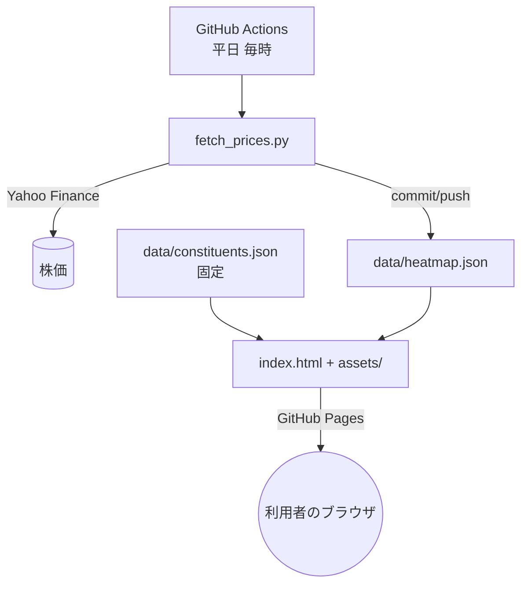
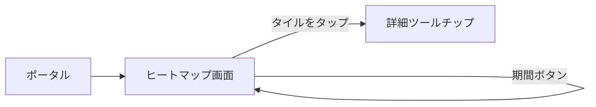

# 機能設計書 — 日経平均225 ヒートマップ

## システム構成

- バックエンドサーバーは存在しない。動的処理はすべてブラウザ内の JavaScript。
- 定期バッチ（Actions）だけがサーバーサイド相当の処理を担う。

## データモデル

### constituents.json（配列・固定）
| フィールド | 型 | 説明 |
|---|---|---|
| code | string | 証券コード（例 "7203", "285A"） |
| name | string | 銘柄名（日本語。JPX公表データ由来） |
| sector | string | 33業種区分（例 "輸送用機器"） |

### heatmap.json（自動生成）
| フィールド | 型 | 説明 |
|---|---|---|
| updated_at | string | 生成時刻（ISO8601, JST） |
| source | string | データ元表記 |
| items[] | array | 銘柄ごとの価格情報 |
| items[].code | string | 証券コード（constituents と結合するキー） |
| items[].price | number \| null | 最新終値（円） |
| items[].market_cap | number \| null | 時価総額の概算（発行株数 × 最新終値） |
| items[].chg_1d / chg_1w / chg_1m | number \| null | 騰落率（％）。基準は 1 / 5 / 21 営業日前の終値 |

## 画面遷移

単一画面。ページ遷移はなく、期間切り替えとツールチップのみ。

## コンポーネント設計（assets/app.js）

| 関数 | 役割 |
|---|---|
| `loadData()` | 2つのJSONを取得し code で結合して `state.rows` に格納 |
| `buildHierarchy(w,h)` | 業種でグループ化し d3.treemap でレイアウト計算 |
| `makeColorScale()` | CSS変数の色から diverging スケールを生成（テーマ追従） |
| `render()` | SVG を再構築（タイル・業種ラベル・凡例）。期間変更・リサイズで呼ぶ |
| `showTooltip()` / `hideTooltip()` | 詳細の吹き出し表示 |
| `setupControls()` | ボタン・リサイズ・テーマ変更・画面外クリックのイベント登録 |

## 定期バッチ（scripts/fetch_prices.py）

1. constituents.json から証券コード一覧を読む。
2. `yfinance.download()` で全銘柄の日足（3ヶ月）を一括取得。
3. 各銘柄の最新／前日／5営業日前／21営業日前の終値から騰落率を計算。
4. 銘柄ごとに `fast_info["shares"]` を取得し、時価総額 ＝ 株数 × 最新終値。
5. heatmap.json を UTF-8 で書き出す。取得失敗銘柄は price=null で出力し処理は継続。

## エラー時の振る舞い
- 一部銘柄の株価取得失敗 → その銘柄のみ null。タイルは灰色。
- heatmap.json 自体の取得失敗 → 画面にメッセージ表示（「読み込めませんでした」）。
- Actions 実行失敗 → 前回の heatmap.json のまま（画面は古いデータで動作）。
